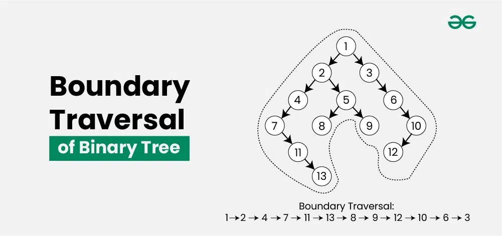

### 1. DFS (Depth-First Search) - Recursive

**Use Cases:** Tree traversals, path problems, subtree properties

**💡 Key Insight:** Process node in preorder (before children), inorder (between children), or postorder (after children). Postorder when you need child info first.

**Time:** O(n) | **Space:** O(h) where h is height

#### Template:

```python
def dfs(node):
    if not node:
        return base_case
  
    # Preorder: process node here
    left_result = dfs(node.left)
    # Inorder: process node here
    right_result = dfs(node.right)
    # Postorder: process node here
  
    return combine(left_result, right_result)
```

**Common Problems:**

- Max Depth, Min Depth, find min/max,
- isValueExists
- Diameter of Binary Tree (543)
- Path Sum problems (112, 113, 437)
- Maximum Path Sum (124)

### 2. BFS (Breadth-First Search) - Level Order

**Use Cases:** Level-by-level processing, shortest path, right/left view

**💡 Key Insight:** Use queue. Process entire level before moving to next. Perfect for problems asking "by level" or "minimum depth".

**Time:** O(n) | **Space:** O(w) where w is max width

#### Template:

```python
from collections import deque

def bfs(root):
    if not root: return []
    q = deque([root])
    result = []
  
    while q:
        level_size = len(q)
        level = []
  
        for _ in range(level_size):
            node = q.popleft()
            level.append(node.val)
  
            if node.left: q.append(node.left)
            if node.right: q.append(node.right)
  
        result.append(level)
  
    return result
```

**Common Problems:**

- Level Order Traversal (102)
- Zigzag Level Order (103)
- Right Side View (199)
- Minimum Depth (111)
- Maximum Level Sum (1161)

### 15. **Diagonal Traversal of a Binary Tree**


**Output**: 8 10 14 3 6 7 13 1 4

- Use a queue to traverse nodes diagonally. For each node, enqueue its left child and move to the right child.
- To find the diagonal view of a binary tree, we perform a recursive  traversal that stores nodes in a hashmap based on their diagonal levels. Left children increase the diagonal level, while right children remain on the same level.

### **3. Level Order Traversal from Bottom to Top**

```java
void traverseFromBottom2Top(Node<T> root) {
    if (root == null) return;

    Queue<Node<T>> q = new LinkedList<>();
    Stack<List<Integer>> stack = new Stack<>();
    q.add(root);

    while (!q.isEmpty()) {
        int size = q.size();
        List<Integer> level = new ArrayList<>();
        for (int i = 0; i < size; i++) {
            Node<T> node = q.poll();
            level.add(node.data);
            if (node.left != null) q.add(node.left);
            if (node.right != null) q.add(node.right);
        }
        stack.push(level);
    }

    while (!stack.isEmpty()) {
        for (int val : stack.pop()) System.out.print(val + " ");
        System.out.println();
    }
}
```

---

* https://leetcode.com/problems/populating-next-right-pointers-in-each-node

### **5. DFS Traversal Without Recursion**

```java
void dfsWithoutRecursion(Node<T> root) {
    if (root == null) return;

    Stack<Node<T>> stack = new Stack<>();
    stack.push(root);

    while (!stack.isEmpty()) {
        Node<T> node = stack.pop();
        System.out.print(node.data + " ");
        if (node.right != null) stack.push(node.right);
        if (node.left != null) stack.push(node.left);
    }
}
```

---

### **6. BFS Traversal Without Recursion**

```java
void bfsWithoutRecursion(Node<T> root) {
    if (root == null) return;

    Queue<Node<T>> q = new LinkedList<>();
    q.add(root);

    while (!q.isEmpty()) {
        Node<T> node = q.poll();
        System.out.print(node.data + " ");
        if (node.left != null) q.add(node.left);
        if (node.right != null) q.add(node.right);
    }
}
```

---

### **7. Get Height of Tree Without Recursion**

```java
int getHeight_m2(Node<T> root) {
    if (root == null) return 0;

    Queue<Node<T>> q = new LinkedList<>();
    q.add(root);
    int height = 0;

    while (!q.isEmpty()) {
        int size = q.size();
        for (int i = 0; i < size; i++) {
            Node<T> node = q.poll();
            if (node.left != null) q.add(node.left);
            if (node.right != null) q.add(node.right);
        }
        height++;
    }
    return height;
}
```

---

### **10.  give a algorithm for finding the level that has the maximum sum in binary tree**

```java
int findLevelWithMaxSum(Node<T> root) {
    if (root == null) return -1;

    Queue<Node<T>> q = new LinkedList<>();
    q.add(root);
    int maxSum = 0, maxLevel = 0, currentLevel = 0;

    while (!q.isEmpty()) {
        int size = q.size();
        int levelSum = 0;

        for (int i = 0; i < size; i++) {
            Node<T> node = q.poll();
            levelSum += node.data;
            if (node.left != null) q.add(node.left);
            if (node.right != null) q.add(node.right);
        }

        if (levelSum > maxSum) {
            maxSum = levelSum;
            maxLevel = currentLevel;
        }
        currentLevel++;
    }
    return maxLevel;
}
```

---

### **11. given a binary tree print all its root-to-leaf paths**

```java
void pathsFinder(Node<T> root) {
    List<Integer> path = new ArrayList<>();
    dfs(root, path);

    void dfs(Node<T> node, List<Integer> path) {
        if (node == null) return;

        path.add(node.data);
        if (node.left == null && node.right == null) {
            System.out.println(path);
        } else {
            dfs(node.left, path);
            dfs(node.right, path);
        }
        path.remove(path.size() - 1);
    }
}
```

---

### **1. Sum of Root-to-Leaf Numbers**

given a binary tree containing digits from 0-9 only , each root-to-leaf path could represent a number. an example
is the root-to-leaf path 1->2->3 which represents the number 123, find the total sum of all root-to-leaf numbers

https://leetcode.com/problems/sum-root-to-leaf-numbers/description/?envType=study-plan-v2&envId=top-interview-150

```java
int sumRoot2LeafNumbers(Node<T> root) {
    return dfs(root, 0);

    int dfs(Node<T> node, int currentSum) {
        if (node == null) return 0;

        currentSum = currentSum * 10 + node.data;

        // If leaf node, return the computed number
        if (node.left == null && node.right == null) {
            return currentSum;
        }

        // Recursive calls for left and right subtrees
        return dfs(node.left, currentSum) + dfs(node.right, currentSum);
    }
}
```

---

### **7. Find Vertical Sum of a Binary Tree**

Give an algorithm for finding thr vertical sum of a binary tree

```java
List<Integer> getVerticalSum(Node<T> root) {
    TreeMap<Integer, Integer> columnSumMap = new TreeMap<>();

    dfs(root, 0, columnSumMap);

    return new ArrayList<>(columnSumMap.values());
}

void dfs(Node<T> node, int column, TreeMap<Integer, Integer> columnSumMap) {
    if (node == null) return;

    // Update the sum for the current column
    columnSumMap.put(column, columnSumMap.getOrDefault(column, 0) + node.data);

    // Recur for left and right subtrees
    dfs(node.left, column - 1, columnSumMap);
    dfs(node.right, column + 1, columnSumMap);
}
```

---

### **8. Zigzag Traversal**

- Use two stacks to alternate between left-to-right and right-to-left traversals at each level.

```java
void zigZagTraversal(Node<T> root) {
    if (root == null) return;

    Queue<Node<T>> queue = new LinkedList<>();
    queue.add(root);
    boolean leftToRight = true;

    while (!queue.isEmpty()) {
        int size = queue.size();
        LinkedList<Integer> level = new LinkedList<>();

        for (int i = 0; i < size; i++) {
            Node<T> node = queue.poll();

            if (leftToRight) {
                level.add(node.data);
            } else {
                level.addFirst(node.data);
            }

            if (node.left != null) queue.add(node.left);
            if (node.right != null) queue.add(node.right);
        }

        System.out.println(level);
        leftToRight = !leftToRight;  // Toggle direction
    }
}
```

### **4. Find the Deepest Node**

```java
Node<T> getDeepestNode(Node<T> root) {
    if (root == null) return null;

    Queue<Node<T>> q = new LinkedList<>();
    q.add(root);
    Node<T> deepestNode = null;

    while (!q.isEmpty()) {
        deepestNode = q.poll();
        if (deepestNode.left != null) q.add(deepestNode.left);
        if (deepestNode.right != null) q.add(deepestNode.right);
    }
    return deepestNode;
}
```

### 🧪 Example: LeetCode 230 – Kth Smallest Element in a BST

```java
class Solution {
    int count = 0;
    int result = -1;

    public int kthSmallest(TreeNode root, int k) {
        inorder(root, k);
        return result;
    }

    private void inorder(TreeNode node, int k) {
        if (node == null) return;

        inorder(node.left, k);

        count++;
        if (count == k) {
            result = node.val;
            return;
        }

        inorder(node.right, k);
    }
}
```

### **3. Check Existence of Path with Given Sum**

give a algorithm for checking the existence of path with given sum. that means , given a sum, check whether there exists a path from root to any of the nodes.

```java
boolean hasPathSum(Node<T> root, int sum) {
    if (root == null) return false;

    // Check if we have reached a leaf node with the exact sum
    if (root.left == null && root.right == null) {
        return sum == root.data;
    }

    // Recur for left and right subtrees with the reduced sum
    return hasPathSum(root.left, sum - root.data) || hasPathSum(root.right, sum - root.data);
}
```

### 16. **Boundary Traversal of a Binary Tree**

- Traverse the left boundary, then leaf nodes, then the right boundary (in reverse order).
