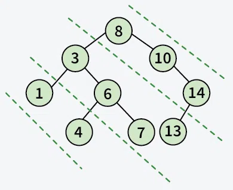

https://chatgpt.com/share/66fe58f2-5008-8006-adbf-3f8e9aa04db2 

### 4. **Diameter of a Tree**
   - The diameter is the longest path between two nodes.
   - Use DFS to calculate the diameter as `max(left_height + right_height + 1)` at each node.
   - Keep track of the maximum diameter during traversal.

### 5. **Mirror of a Tree**
   - **Recursive Approach:** Swap the left and right children of each node recursively.
   - **Iterative Approach:** Use level order traversal and swap children at each level.

### 6. **Inorder/Preorder/Postorder Traversal (Recursive & Iterative)**
   - **Recursive:** Traverse left subtree, visit node, traverse right subtree.
   - **Iterative:** Use a stack to simulate recursion. Push nodes, go left, pop nodes when left is exhausted.

### 9. **Left View of a Tree**
   - Use level order traversal and track the first node at each level.

### 10. **Right View of a Tree**
   - Similar to left view, but track the last node at each level during level order traversal.

### 11. **Top View of a Tree**
   - Perform a level order traversal while maintaining horizontal distances. Track the first node at each horizontal distance.

### 12. **Bottom View of a Tree**
   - Similar to top view but track the last node at each horizontal distance.

### 13. **Zig-Zag Traversal of a Binary Tree**
   - Use two stacks to alternate between left-to-right and right-to-left traversals at each level.

### 14. **Check if a Tree is Balanced**
   - A tree is balanced if the height difference between the left and right subtree is at most 1 for all nodes.
   - Calculate height and check balance recursively.

### 15. **Diagonal Traversal of a Binary Tree**
 

**Output**: 8 10 14 3 6 7 13 1 4

   - Use a queue to traverse nodes diagonally. For each node, enqueue its left child and move to the right child.
   - To find the diagonal view of a binary tree, we perform a recursive  traversal that stores nodes in a hashmap based on their diagonal levels. Left children increase the diagonal level, while right children remain on the same level.

### 16. **Boundary Traversal of a Binary Tree**
   - Traverse the left boundary, then leaf nodes, then the right boundary (in reverse order).

### 17. **Construct Binary Tree from String with Bracket Representation**
   - Use recursion and string parsing to interpret brackets as indicators of subtree boundaries.

### 18. **Convert Binary Tree into Doubly Linked List**
   - Perform in-order traversal, convert each node into a doubly linked list node, and link them together.

### 19. **Convert Binary Tree into Sum Tree**
   - Recursively replace each node with the sum of its left and right subtrees while returning  Finally, return the sum of new value and value (which is sum of values in the subtree rooted with this node).

### 20. **Construct Binary Tree from Inorder and Preorder Traversal**
   - Use recursion and index tracking to build the tree. The first element in preorder is the root; use inorder to find left and right subtrees.

### 21. **Find Minimum Swaps to Convert Binary Tree to BST**
   - In-order traversal of the tree yields a list. Count the minimum swaps required to sort the list.

### 22. **Check if Binary Tree is Sum Tree**
   - A sum tree is one where the value of each node is equal to the sum of its left and right subtree values.
   - Use a post-order traversal to verify the sum property.

### 23. **Check if All Leaf Nodes are at the Same Level**
   - Use level order traversal and check the levels of leaf nodes.

### 24. **Check if a Binary Tree Contains Duplicate Subtrees of Size 2 or More**
   - Use serialization (or hashing) of subtrees to detect duplicates during post-order traversal.

### 25. **Check if Two Trees are Mirror**
   - Recursively compare the left subtree of one tree with the right subtree of the other.

### 26. **Sum of Nodes on the Longest Path from Root to Leaf Node**
   - Use DFS to find the path with the maximum depth and calculate the sum of its nodes.

### 27. **Check if Given Graph is Tree**
   - A graph is a tree if it is connected and has no cycles.
   - Use BFS/DFS to verify connectivity and absence of cycles.

### 28. **Find Largest Subtree Sum in a Tree**
   - Perform a post-order traversal to calculate the sum of each subtree and track the maximum.

### 29. **Maximum Sum of Nodes in a Binary Tree Such that No Two are Adjacent**
   - Use dynamic programming with two states: include the current node or exclude it.

### 30. **Print All “K” Sum Paths in a Binary Tree**
   - Use DFS and backtracking to find all paths from any node that sum to `K`.

### 31. **Find LCA in a Binary Tree**
   - Use recursion to find the lowest common ancestor by exploring left and right subtrees.

### 32. **Find Distance Between Two Nodes in a Binary Tree**
   - Find LCA of the two nodes, then calculate the distance from LCA to each node.

### 33. **Kth Ancestor of a Node in a Binary Tree**
   - Use recursion to track ancestors and return the `Kth` one when the target node is found.

### 34. **Find All Duplicate Subtrees in a Binary Tree**
   - Use serialization (or hashing) of subtrees during post-order traversal to detect duplicates.

### 35. **Tree Isomorphism Problem**
   - Check if two trees can be transformed into each other by flipping subtrees.

### 40. **Check if a Tree is a BST**
   - Perform in-order traversal and check if the sequence is sorted.

### 41. **Populate Inorder Successor of All Nodes**
   - Traverse the tree in reverse in-order and link each node to its successor.

### 42. **Find LCA of Two Nodes in a BST**
   - Use binary search to find the split point where the two nodes diverge in the tree.

### 43. **Construct BST from Preorder Traversal**
   - Use recursion or a stack to build the BST by inserting nodes in preorder sequence.

### 44. **Convert Binary Tree into BST**
   - Extract the in-order traversal of the binary tree, sort it, and reconstruct the tree to follow BST properties.

### 45. **Convert a Normal BST into a Balanced BST**
   - Extract the in-order traversal of the BST, then use a recursive method to build a balanced BST from the sorted list.

### 46. **Merge Two BSTs**
   - In-order traverse both trees, merge the two sorted arrays, and build a new BST from the merged list.

### 47. **Find Kth Largest Element in a BST**
   - Perform reverse in-order traversal and count nodes until you reach the `Kth` largest node.

### 48. **Find Kth Smallest Element in a BST**
   - Perform in-order traversal and count nodes until you reach the `Kth` smallest node.

### 49. **Count Pairs from Two BSTs Whose Sum is Equal to Given Value X**
   - Use two stacks for in-order and reverse in-order traversal to find pairs.

### 50. **Find the Median of a BST in O(n) Time and O(1) Space**
   - Use Morris in-order traversal to find the median without using extra space.

### 51. **Count BST Nodes that Lie in a Given Range**
   - Perform a modified in-order traversal and count nodes within the range.

### 52. **Replace Every Element with the Least Greater Element on Its Right**
   - Traverse the array from right to left, using a BST to keep track of seen elements and find the least greater element for each node.

### 53. **Given “n” Appointments, Find the Conflicting Appointments**
   - Sort appointments by start time and use a min-heap to track overlapping appointments.

### 54. **Check if Preorder is Valid for a BST**
   - Use a stack and