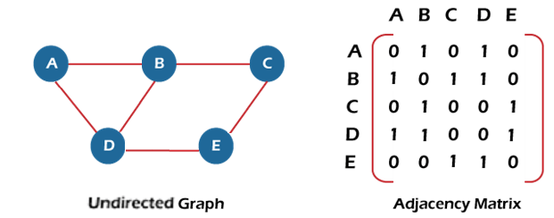

//    MST -> PK -> P -> graph starts PriorityQueue 0 edge +  BFS and K -> PriorityQueue + all edges + DSU
//    note -> use only if you know graph is DAG for this (stack and DFS) else use kahn's algorithm (in-degree and queue


in the real world , many problems are representated in terms of objects and connections between them.
for example, airline routes, electric circuits , LAN and internet , facebook friends etc

**Graph**: a graph is a pair (V,E), where V is a set of nodes, called vertices (vertex) and E is collection of pairs of vertices





type of graphs:
- Directed, undirected , weighted and unweighted graphs
- two connected nodes are called adjacent nodes.
- no cyclic in the graph is an acyclic graph

### Representation of graph :

1. Adjacency Matrix (matrix n*n)
2. Adjacency List (using hashmap or node with hashmap(weighted))

To Represent graphs, we need the number of vertices, the number edges (u,v) with their connections for example:
Input: n = 3, edges = [[1,3],[2,3],[3,1]]

```java
// adjacencyList
    Map<Integer,Set<Integer>> adjacencyList = new HashMap<>();
//weighted adjacency
    Map<Node,Map<Node,Integer>> adjacencyList = new HashMap<>();

// adjacencyMatrix
    int[][] matrix = new int[n][n];
    
    for(int[] edge : edges){
        matrix[edge[0]][edge[1]]=1 or adjacencyList.get(edge[0]).add(edge[1]);
        
        }
    
    
```


To keep track of no of connections or isVisited you can have array or map for example
```java
    int[] visited = new int[n];
//    visited[i] = true; means i node id visited
//    counter[i]++; means i nodes total connections with other nodes
// visited = set()   use hashset as well for tracking visited 
```


### 1. **Create a Graph, Print it**
- Use adjacency matrix or adjacency list to store the graph.
- Print the graph by iterating over the matrix/list and displaying connections.
```java
public class Graph<T> {
    private final HashMap<T, List<T>> adjList;
    private final boolean bidirection;

    public HashMap<T, List<T>> getAdjList() {
        return adjList;
    }

    public Graph(boolean bidirection) {
        adjList = new HashMap<>();
        this.bidirection = bidirection;
    }

    public void addVertex(T v){
        adjList.put(v, new ArrayList<T>());
    }

    public void addEdge(T source, T destination){
        if(!adjList.containsKey(source))
            addVertex(source);
        if (!adjList.containsKey(destination))
            addVertex(destination);
        adjList.get(source).add(destination);
        if (bidirection)
            adjList.get(destination).add(source);
    }
```

### DFS:

```java
/*                                  Number of Connected Components
----------------------------------------------------------------------------------------------------------*/
    public static int ConnectedComponents(Graph<Integer> graph){
        HashSet<Integer> visited = new HashSet<>();
        int count = 0;
        for (int node: graph.getAdjList().keySet()){
            if(explore(graph, node, visited))
                count++;
        }
        return count;
    }

    private static boolean explore(Graph<Integer> graph, int current, HashSet<Integer> visited) {
        if (visited.contains(current))
            return false;

        visited.add(current);
        for (int neighbour: graph.getAdjList().get(current)){
            explore(graph, neighbour, visited);
        }
        return true;
    }
/*--------------------------------------------------------------------------------------------------------*/
```


```java
/*                                   Number of island (DFS)
-------------------------------------------------------------------------------------------------*/
    public static int islandCount(char[][] grid){
        HashSet<String> visited = new HashSet<>();
        int count = 0;

        for (int r = 0; r < grid.length; r++) {
            for (int c = 0; c < grid[0].length; c++) {
                if(explore(grid, r, c, visited))
                    count++;
            }
        }
        return count;
    }

    private static boolean explore(char[][] grid, int r, int c, HashSet<String> visited) {
        boolean rowInbounds = 0 <= r && r < grid.length;
        boolean colInbounds = 0 <= c && c < grid[0].length;
        if (!rowInbounds || !colInbounds)
            return false;

        if (grid[r][c] == 'W') // 'W' Means Water and 'L' Means Land
            return false;

        String pos = r + "," + c;
        if (visited.contains(pos))
            return false;

        visited.add(pos);

        explore(grid, r - 1, c, visited);
        explore(grid, r + 1, c, visited);
        explore(grid, r, c - 1, visited);
        explore(grid, r, c + 1, visited);

        return true;
    }
/*-------------------------------------------------------------------------------------------------*/
```


### 3. **Implement DFS Algorithm**
- Use a stack (or recursion) for DFS traversal.
- Track visited nodes to avoid infinite loops.
- **DFS is useful for exploring deeper paths first.**

```java
import java.util.HashMap;

/*                             DFS Iterative Method
-------------------------------------------------------------------------------------*/
private static void dfs(Graph<String> graph, String source) {
    Stack<String> stack = new Stack<>();
    stack.push(source);
    Map<String, Boolean> visited = new HashMap<>();

    while (!stack.empty()) {
        String curr = stack.pop();
        System.out.println(curr);

        for (String neighbour : graph.getAdjList().get(curr)) {
            if (visited.get(neighbour) == null){
                stack.push(neighbour);
                visited.put(neighbour, false);
            }
        }
    }
}
/*-----------------------------------------------------------------------------------*/

/*                           DFS Recursive Method
-------------------------------------------------------------------------------------*/
private static void dfs(Graph<String> graph, String source) {
    System.out.println(source);

    for (String neighbour : graph.getAdjList().get(source)) {
        if (visited.get(neighbour) == null) {
            visited.put(neighbour, false);
            dfs(graph, neighbour);
        }
    }
    String curr = stack.pop();
    System.out.println(curr);
}
/*-----------------------------------------------------------------------------------*/
```
15. **Find if There is a Path of More Than K Length from a Source**
    -The "Path of Greater than Equal to k length" problem is a graph traversal problem where we need to determine
    whether there exists a path in an undirected weighted graph whose total weight is greater than or equal to
    k. This problem is typically solved using Depth First Search (DFS) with backtracking.

```java

import java.util.*;

class Solution {
    public boolean dfs(List<List<int[]>> adj, boolean[] visited, int node, int currentSum, int k) {
        // If current path sum is already >= k, return true
        if (currentSum >= k) return true;

        visited[node] = true; // Mark node as visited

        for (int[] neighbor : adj.get(node)) {
            int nextNode = neighbor[0];
            int weight = neighbor[1];

            if (!visited[nextNode]) {
                if (dfs(adj, visited, nextNode, currentSum + weight, k)) {
                    return true;
                }
            }
        }

        visited[node] = false; // Backtrack
        return false;
    }

    public boolean pathMoreThanK(int N, int M, int K, int[][] edges) {
        List<List<int[]>> adj = new ArrayList<>();
        
        // Initialize adjacency list
        for (int i = 0; i < N; i++) {
            adj.add(new ArrayList<>());
        }

        // Build the graph
        for (int[] edge : edges) {
            int u = edge[0], v = edge[1], w = edge[2];
            adj.get(u).add(new int[]{v, w});
            adj.get(v).add(new int[]{u, w}); // Since the graph is undirected
        }

        boolean[] visited = new boolean[N];

        // Start DFS from node 0
        return dfs(adj, visited, 0, 0, K);
    }

    public static void main(String[] args) {
        Solution solution = new Solution();
        int N = 4, M = 3, K = 8;
        int[][] edges = {{0, 1, 4}, {1, 2, 3}, {2, 3, 5}};

        System.out.println(solution.pathMoreThanK(N, M, K, edges)); // Output: true
    }
}

```

Start DFS from nodes at boundary:
* https://leetcode.com/problems/surrounded-regions/
* https://leetcode.com/problems/number-of-enclaves/
* https://leetcode.com/problems/time-needed-to-inform-all-employees/
* https://leetcode.com/problems/find-eventual-safe-states/description/

DFS from each unvisited node/Island problems
* https://leetcode.com/problems/number-of-closed-islands/
* https://leetcode.com/problems/number-of-islands/
* https://leetcode.com/problems/keys-and-rooms/
* https://leetcode.com/problems/max-area-of-island/
* https://leetcode.com/problems/flood-fill/


### 4. **Detect Cycle in Undirected Graph using BFS/DFS Algorithm**
- **DFS:** Track the parent of each node; if you find an edge that leads to a previously visited node that is not the parent, a cycle is detected.
- **BFS:** Use a queue and track parent nodes similarly to DFS.

```java
/*                                 Detect cycle in an undirected graph
---------------------------------------------------------------------------------------------------------------*/
    public boolean isCycle(int V, ArrayList<ArrayList<Integer>> adj) {
        HashSet<Integer> visited = new HashSet<>();

        for (int i = 0; i < V; i++) {
            if (!visited.contains(i)){
                if (dfs(adj, i, -1, visited))
                        return true;
            }
        }
        return false;
    }

    private boolean dfs(ArrayList<ArrayList<Integer>> adj, int src, int parent, HashSet<Integer> visited)
    {
        visited.add(src);

        for (int neighbour : adj.get(src)){
            if (!visited.contains(neighbour)) {
                if (dfs(adj, neighbour, src, visited))
                    return true;
            } else if (parent != neighbour) {
                return true;
            }
        }
        return false;
    }
/*-------------------------------------------------------------------------------------------------------------*/

```


### 5. **Detect Cycle in Directed Graph using BFS/DFS Algorithm**
- **DFS Approach:** Maintain a recursion stack to check for back edges (edges that point to an ancestor in DFS tree).
- **BFS Approach (Kahn’s Algorithm):** Use topological sorting and check for leftover nodes (a cycle exists if a topological sort is not possible).

```java
/*                                      Detect cycle in Directed graph
----------------------------------------------------------------------------------------------------------------*/
    public boolean isCyclic(int V, ArrayList<ArrayList<Integer>> adj) {
        boolean[] visited = new boolean[V];
        boolean[] recstack = new boolean[V];

        for (int i = 0; i < V; i++){
            if (dfs(adj, i, visited, recstack))
                return true;
        }
        return false;
    }

    private boolean dfs(ArrayList<ArrayList<Integer>> adj, int src, boolean[] visited, boolean[] recstack) {
        if (recstack[src])
            return true;
        if (visited[src])
            return false;

        visited[src] = true;
        recstack[src] = true;

        for (int neighbour : adj.get(src)){
            if (dfs(adj, neighbour, visited, recstack))
                return true;
        }
        recstack[src] = false;
        return false;
    }
/*--------------------------------------------------------------------------------------------------------------*/
```

M2
```java

public boolean isCyclic(int V, Map<Integer, List<Integer>> adj) {
    int[] state = new int[V]; // 0 = unvisited, 1 = visiting, 2 = visited

    for (int i = 0; i < V; i++) {
        if (state[i] == 0 && checkCycle(adj, i, state)) {
            return true;  // Cycle detected
        }
    }
    return false;
}

private boolean checkCycle(Map<Integer, List<Integer>> adj, int src, int[] state) {
    if (state[src] == 1) return true;  // Cycle detected
    if (state[src] == 2) return false; // Already processed

    state[src] = 1; // Mark as visiting

    for (int neighbour : adj.getOrDefault(src, new ArrayList<>())) {
        if (checkCycle(adj, neighbour, state)) {
            return true;  // Cycle found
        }
    }

    state[src] = 2; // Mark as visited (fully processed)
    return false;
}

```


### 5. **All possible paths from scr to dst using BFS/DFS Algorithm**
https://leetcode.com/problems/all-paths-from-source-to-target/description/

### 5. **All possible paths from scr to dst using BFS/DFS Algorithm with at most k stops**
* https://leetcode.com/problems/cheapest-flights-within-k-stops/solutions/3102509/normal-bfs-in-cpp/

https://leetcode.com/problems/snakes-and-ladders/solutions/?envType=study-plan-v2&envId=top-interview-150


https://leetcode.com/problems/minimum-time-to-collect-all-apples-in-a-tree/submissions/1586147821/


how to solve this in asked in graph : https://leetcode.com/problems/all-nodes-distance-k-in-binary-tree/description/?envType=company&envId=amazon&favoriteSlug=amazon-three-months


### 9. **Clone a Graph**
- Use BFS or DFS to traverse the graph and create a deep copy.
- Keep a hashmap of original nodes to their clones to avoid duplicate copies.


### 11. **Word Ladder**
- Treat each word as a node and edges between words that differ by one character.
- DFS
```python
from typing import List, Set

class Solution:
    def ladderLength(self, beginWord: str, endWord: str, wordList: List[str]) -> int:
        wordSet = set(wordList)  # Convert wordList to a set for O(1) lookup
        if endWord not in wordSet:
            return 0  # If endWord is not present, transformation is impossible
        
        self.min_length = float('inf')
        visited = set([beginWord])  # Track visited words
        
        # Call the DFS function
        self.dfs(beginWord, endWord, wordSet, visited, 1)
        
        return self.min_length if self.min_length != float('inf') else 0
    
    def dfs(self, currentWord: str, endWord: str, wordSet: Set[str], visited: Set[str], depth: int):
        """ Helper function for performing DFS traversal """
        if currentWord == endWord:
            self.min_length = min(self.min_length, depth)
            return
        
        # Try modifying each character in the current word
        for i in range(len(currentWord)):
            for char in 'abcdefghijklmnopqrstuvwxyz':
                newWord = currentWord[:i] + char + currentWord[i+1:]
                if newWord in wordSet and newWord not in visited:
                    visited.add(newWord)
                    self.dfs(newWord, endWord, wordSet, visited, depth + 1)
                    visited.remove(newWord)  # Backtracking
 

```
### 31. **Journey to the Moon**
- Treat each country as a connected component and count the ways to choose astronaut pairs from different countries using combination counting.

https://leetcode.com/problems/find-the-town-judge/description/?envType=problem-list-v2&envId=graph&difficulty=EASY
https://leetcode.com/problems/find-center-of-star-graph/description/?envType=problem-list-v2&envId=graph&difficulty=EASY
https://leetcode.com/problems/find-if-path-exists-in-graph/submissions/1427991963/?envType=problem-list-v2&envId=graph&difficulty=EASY


### 26. **Find Bridge in a Graph**
- Use DFS and track discovery and low values of each node to detect bridges (edges whose removal increases the number of connected components).

### 33. **Oliver and the Game**
- DFS-based problem that involves traversing a tree and managing game moves based on tree properties.

### 34. **Water Jug Problem using BFS**
- Treat each state (jug water levels) as a node and use BFS to find the shortest sequence of operations to reach the goal.

### 35. **Find if Path of More than K Length Exists**
- Use DFS to explore paths and prune those that exceed the required length early.

### 36. **M-Coloring Problem**
- Use backtracking to assign colors to nodes such that adjacent nodes don’t share the same color.

### 37. **Minimum Edges to Reverse to Make Path from Source to Destination**
- Use BFS/DFS to explore and count the number of edges that need to be reversed to form the path.

### 38. **Paths to Travel Each Node Using Each Edge (Seven Bridges)**
- This problem involves Eulerian paths and circuits. Use DFS to determine the number of Eulerian paths or circuits.

### 39. **Vertex Cover Problem**
- Use backtracking or approximation algorithms (greedy method) to find the minimum vertex cover.

### 40. **Chinese Postman or Route Inspection**
- Find an Eulerian circuit (or augment the graph to make it Eulerian) to minimize the traversal cost.

### 41. **Number of Triangles in a Graph**
- Count triangles using adjacency matrix or list, leveraging combinatorial methods.

### 42. **Minimize Cash Flow among Friends**
- Use a graph where vertices represent people and edges represent the net balance between pairs, then minimize cash flow using a greedy approach.


