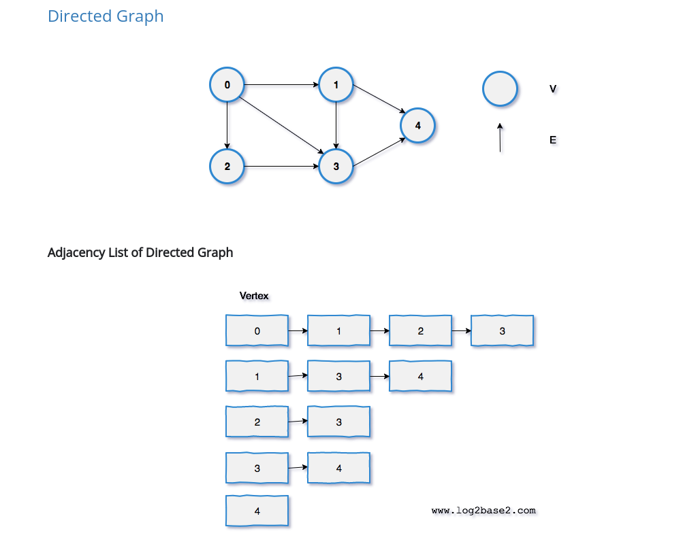

in the real world , many problems are representated in terms of objects and connections between them.
for example, airline routes, electric circuits , LAN and internet , facebook friends etc

**Graph**: a graph is a pair (V,E), where V is a set of nodes, called vertices (vertex) and E is collection of pairs of vertices




type of graphs:
- Directed, undirected , weighted and unweighted graphs
- two connected nodes are called adjacent nodes.
- no cyclic in the graph is an acyclic graph

### Representation of graph :

1. Adjacency Matrix (matrix n*n)
2. Adjacency List (using hashmap or node with hashmap(weighted))

To Represent graphs, we need the number of vertices, the number edges (u,v) with their connections for example:
Input: n = 3, edges = [[1,3],[2,3],[3,1]]

```java
// adjacencyList
    Map<Integer,Set<Integer>> adjacencyList = new HashMap<>();
//weighted adjacency
    Map<Node,Map<Node,Integer>> adjacencyList = new HashMap<>();

// adjacencyMatrix
    int[][] matrix = new int[n][n];
    
    for(int[] edge : edges){
        matrix[edge[0]][edge[1]]=1 or adjacencyList.get(edge[0]).add(edge[1]);
        
        }
    
    
```


To keep track of no of connections or isVisited you can have array or map for example
```java
    int[] visited = new int[n];
//    visited[i] = true; means i node id visited
//    counter[i]++; means i nodes total connections with other nodes
```


### Representation of graph in Databases:


### 1. **Create a Graph, Print it**
   - Use adjacency matrix or adjacency list to store the graph.
   - Print the graph by iterating over the matrix/list and displaying connections.
```java
public class Graph<T> {
    private final HashMap<T, List<T>> adjList;
    private final boolean bidirection;

    public HashMap<T, List<T>> getAdjList() {
        return adjList;
    }

    public Graph(boolean bidirection) {
        adjList = new HashMap<>();
        this.bidirection = bidirection;
    }

    public void addVertex(T v){
        adjList.put(v, new ArrayList<T>());
    }

    public void addEdge(T source, T destination){
        if(!adjList.containsKey(source))
            addVertex(source);
        if (!adjList.containsKey(destination))
            addVertex(destination);
        adjList.get(source).add(destination);
        if (bidirection)
            adjList.get(destination).add(source);
    }
```

### 2. **Implement BFS Algorithm**
   - Use a queue for BFS traversal.
   - Track visited nodes to avoid cycles and repetition.
   - BFS is ideal for finding the shortest path in unweighted graphs.

```java
/*                                   BFS Method
-------------------------------------------------------------------------------------*/
    private static void bfs(Graph<String> graph, String source ){
        Queue<String> queue = new LinkedList<>();
        queue.add(source);
        int level = 0;
        
        while (!queue.isEmpty()){
			int sz = queue.size();          // level size    
			for(int i = 0; i < sz; i++){
				String curr = queue.poll();
				System.out.println(curr);

				for (String neighbour: graph.getAdjList().get(curr))
					queue.add(neighbour);
            }
            level++;
        }
    }
/*-----------------------------------------------------------------------------------*/
```


BFS for shortest path:
* https://leetcode.com/problems/01-matrix/
* https://leetcode.com/problems/as-far-from-land-as-possible/
* https://leetcode.com/problems/rotting-oranges/
* https://leetcode.com/problems/shortest-path-in-binary-matrix/

Graph coloring:
* https://leetcode.com/problems/possible-bipartition/
* https://leetcode.com/problems/is-graph-bipartite/


```java
/*                                  Number of Connected Components
----------------------------------------------------------------------------------------------------------*/
    public static int ConnectedComponents(Graph<Integer> graph){
        HashSet<Integer> visited = new HashSet<>();
        int count = 0;
        for (int node: graph.getAdjList().keySet()){
            if(explore(graph, node, visited))
                count++;
        }
        return count;
    }

    private static boolean explore(Graph<Integer> graph, int current, HashSet<Integer> visited) {
        if (visited.contains(current))
            return false;

        visited.add(current);
        for (int neighbour: graph.getAdjList().get(current)){
            explore(graph, neighbour, visited);
        }
        return true;
    }
/*--------------------------------------------------------------------------------------------------------*/
```


### 3. **Implement DFS Algorithm**
   - Use a stack (or recursion) for DFS traversal.
   - Track visited nodes to avoid infinite loops.
   - DFS is useful for exploring deeper paths first.

```java
import java.util.HashMap;

/*                             DFS Iterative Method
-------------------------------------------------------------------------------------*/
private static void dfs(Graph<String> graph, String source) {
    Stack<String> stack = new Stack<>();
    stack.push(source);
    Map<String, Boolean> visited = new HashMap<>();

    while (!stack.empty()) {
        String curr = stack.pop();
        System.out.println(curr);

        for (String neighbour : graph.getAdjList().get(curr)) {
            if (visited.get(neighbour) == null){
                stack.push(neighbour);
                visited.put(neighbour, false);
            }
        }
    }
}
/*-----------------------------------------------------------------------------------*/

/*                           DFS Recursive Method
-------------------------------------------------------------------------------------*/
private static void dfs(Graph<String> graph, String source) {
    System.out.println(source);

    for (String neighbour : graph.getAdjList().get(source)) {
        if (visited.get(neighbour) == null) {
            visited.put(neighbour, false);
            dfs(graph, neighbour);
        }
    }
}
/*-----------------------------------------------------------------------------------*/
```

Start DFS from nodes at boundary:
* https://leetcode.com/problems/surrounded-regions/
* https://leetcode.com/problems/number-of-enclaves/
* https://leetcode.com/problems/time-needed-to-inform-all-employees/
* https://leetcode.com/problems/find-eventual-safe-states/description/

DFS from each unvisited node/Island problems
* https://leetcode.com/problems/number-of-closed-islands/
* https://leetcode.com/problems/number-of-islands/
* https://leetcode.com/problems/keys-and-rooms/
* https://leetcode.com/problems/max-area-of-island/
* https://leetcode.com/problems/flood-fill/


### 4. **Detect Cycle in Undirected Graph using BFS/DFS Algorithm**
   - **DFS:** Track the parent of each node; if you find an edge that leads to a previously visited node that is not the parent, a cycle is detected.
   - **BFS:** Use a queue and track parent nodes similarly to DFS.

```java
/*                                 Detect cycle in an undirected graph
---------------------------------------------------------------------------------------------------------------*/
    public boolean isCycle(int V, ArrayList<ArrayList<Integer>> adj) {
        HashSet<Integer> visited = new HashSet<>();

        for (int i = 0; i < V; i++) {
            if (!visited.contains(i)){
                if (dfs(adj, i, -1, visited))
                        return true;
            }
        }
        return false;
    }

    private boolean dfs(ArrayList<ArrayList<Integer>> adj, int src, int parent, HashSet<Integer> visited)
    {
        visited.add(src);

        for (int neighbour : adj.get(src)){
            if (!visited.contains(neighbour)) {
                if (dfs(adj, neighbour, src, visited))
                    return true;
            } else if (parent != neighbour) {
                return true;
            }
        }
        return false;
    }
/*-------------------------------------------------------------------------------------------------------------*/

```


### 5. **Detect Cycle in Directed Graph using BFS/DFS Algorithm**
   - **DFS Approach:** Maintain a recursion stack to check for back edges (edges that point to an ancestor in DFS tree).
   - **BFS Approach (Kahn’s Algorithm):** Use topological sorting and check for leftover nodes (a cycle exists if a topological sort is not possible).

```java
/*                                      Detect cycle in Directed graph
----------------------------------------------------------------------------------------------------------------*/
    public boolean isCyclic(int V, ArrayList<ArrayList<Integer>> adj) {
        boolean[] visited = new boolean[V];
        boolean[] recstack = new boolean[V];

        for (int i = 0; i < V; i++){
            if (dfs(adj, i, visited, recstack))
                return true;
        }
        return false;
    }

    private boolean dfs(ArrayList<ArrayList<Integer>> adj, int src, boolean[] visited, boolean[] recstack) {
        if (recstack[src])
            return true;
        if (visited[src])
            return false;

        visited[src] = true;
        recstack[src] = true;

        for (int neighbour : adj.get(src)){
            if (dfs(adj, neighbour, visited, recstack))
                return true;
        }
        recstack[src] = false;
        return false;
    }
/*--------------------------------------------------------------------------------------------------------------*/
```

M2
```java

public boolean isCyclic(int V, Map<Integer, List<Integer>> adj) {
    int[] state = new int[V]; // 0 = unvisited, 1 = visiting, 2 = visited

    for (int i = 0; i < V; i++) {
        if (state[i] == 0 && checkCycle(adj, i, state)) {
            return true;  // Cycle detected
        }
    }
    return false;
}

private boolean checkCycle(Map<Integer, List<Integer>> adj, int src, int[] state) {
    if (state[src] == 1) return true;  // Cycle detected
    if (state[src] == 2) return false; // Already processed

    state[src] = 1; // Mark as visiting

    for (int neighbour : adj.getOrDefault(src, new ArrayList<>())) {
        if (checkCycle(adj, neighbour, state)) {
            return true;  // Cycle found
        }
    }

    state[src] = 2; // Mark as visited (fully processed)
    return false;
}

```


### 5. **All possible paths from scr to dst using BFS/DFS Algorithm**
https://leetcode.com/problems/all-paths-from-source-to-target/description/ 

### 5. **All possible paths from scr to dst using BFS/DFS Algorithm with at most k stops** 
* https://leetcode.com/problems/cheapest-flights-within-k-stops/solutions/3102509/normal-bfs-in-cpp/

https://leetcode.com/problems/snakes-and-ladders/solutions/?envType=study-plan-v2&envId=top-interview-150

