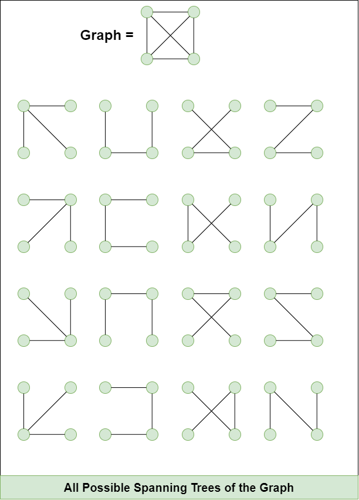

## **Spanning tree**

**Spanning tree** : A spanning tree is a subset of Graph G, such that all the vertices are connected using minimum possible number of edges. Hence, a spanning tree does not have cycles and a graph may have more than one spanning tree.



**Properties of a Spanning Tree:**

* A Spanning tree does not exist for a disconnected graph.
* For a connected graph having N vertices then the number of edges in the spanning tree for that graph will be N-1.
* A Spanning tree does not have any cycle.
* We can construct a spanning tree for a complete graph by removing E-N+1 edges, where E is the number of Edges and N is the number of vertices.
* Cayley’s Formula: It states that the number of spanning trees in a complete graph with N vertices isN^{N-2}       


**Minimum spanning tree** the sum of the edge weights in spanning tree is min

**Maximum spanning tree** the sum of the edge weights in spanning tree is max

### 18. **Prim’s Algorithm** 
    A greedy algorithm that starts with single vertex and grows the MST by adding the smallest edge that connects a vertex in the MST which is outside of MST.
   - Use a priority queue to greedily pick the minimum weight edge expanding the MST, ensuring no cycles are formed

```java
import java.util.*;

import java.util.*;

class Edge {
    int src, dst, weight;

    public Edge(int src, int dst, int weight) {
        this.src = src;
        this.dst = dst;
        this.weight = weight;
    }
}

public class PrimsAlgorithm {
    public int mst(int[][] edges, int n) {
        // Step 1: Build Graph as an Adjacency List
        Map<Integer, List<Edge>> graph = new HashMap<>();
        for (int i = 0; i < n; i++) {
            graph.put(i, new ArrayList<>());
        }
        for (int[] edge : edges) {
            int u = edge[0], v = edge[1], w = edge[2];
            graph.get(u).add(new Edge(u, v, w));
            graph.get(v).add(new Edge(v, u, w)); // Since it's an undirected graph
        }

        // Step 2: Use a Priority Queue (Min-Heap) to pick the smallest edge
        PriorityQueue<Edge> queue = new PriorityQueue<>(Comparator.comparingInt(e -> e.weight));
        queue.add(new Edge(0, 0, 0)); // Start from node 0

        int cost = 0;
        int[] visited = new int[n];

        while (!queue.isEmpty()) {
            Edge temp = queue.poll();
            // Step 3: Add edge to MST
            visited[temp.dst] = 1;
            cost += temp.weight;

            // Step 4: Add all valid neighbors to the queue
            for (Edge neighbour : graph.get(temp.dst)) {
                if (visited[neighbour.dst] == 0) {
                    queue.add(neighbour);
                }
            }
        }

        return cost;
    }

    public static void main(String[] args) {
        int[][] edges = {
                {0, 1, 2}, {0, 3, 6}, {1, 2, 3}, {1, 3, 8}, {1, 4, 5}, {2, 4, 7}, {3, 4, 9}
        };
        int n = 5;
        PrimsAlgorithm prim = new PrimsAlgorithm();
        System.out.println("Minimum Cost of MST: " + prim.mst(edges, n));
    }
}
```

### 19. **Kruskal’s Algorithm**
   - Sort edges by weight and use the union-find data structure to form the minimum spanning tree by avoiding cycles.


### important question 
https://leetcode.com/problems/min-cost-to-connect-all-points/description/?envType=problem-list-v2&envId=minimum-spanning-tree

----
